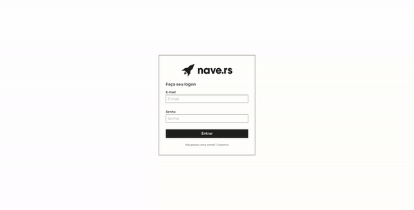

  

 

  
  
  
  

 

---

# Table of contents
* [About](#About)
* [Technologies](#Technologies)
* [API](#API)
* [Figma](#figma)
* [Installation](#Installation)
* [License](#memo-License)

## About

The application consists of a web app for viewing, editing, deleting and creating the Navers, with information such as: names, ages, positions, company time and projects that participated.

## Technologies

- [ReactJS](https://reactjs.org/)
- [Axios](https://github.com/axios/axios)
- [Styled Components](https://styled-components.com/)
- [Typescript](https://www.typescriptlang.org/)
- [Yup](https://github.com/jquense/yup)

## API

The API documentation can be used with the postman by importing this [link](https://www.getpostman.com/collections/e6afe4028c2a1e56e577)

## Figma

To access the application layout, access this [link](https://www.figma.com/file/II8UDFm2uJFZaD0FOPcinP/Teste-Fornt-End)

## Installation

1. Clone the repository: `git@github.com:matheus-neves/navedex.git`
2. Access the directory: `cd navedex`
3. Install the dependencies: `yarn`
4. Run the app: `yarn start`

## :memo: License

This challenge is under license from MIT. See the archive [LICENSE](https://github.com/matheus-neves/navedex/LICENSE.md) for more details.

---

Made with 💜 &nbsp; by Matheus Neves [See my linkedin!](https://www.linkedin.com/in/matheus-neves-front-end/) :wave:
